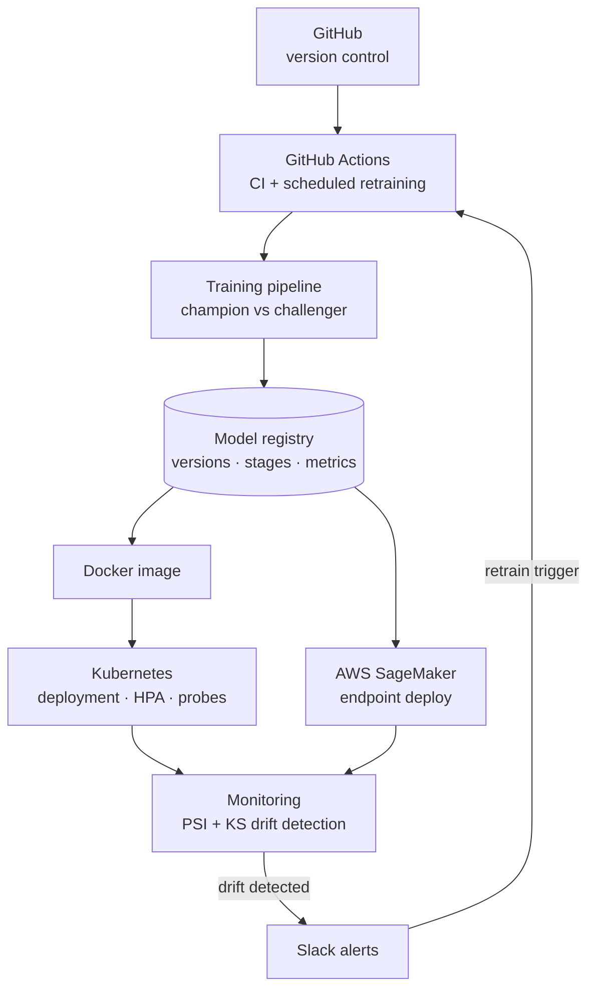

# Enterprise MLOps Platform

[](https://github.com/saianthireddy/enterprise-mlops-platform/actions/workflows/ci.yml) [](https://github.com/saianthireddy/enterprise-mlops-platform/actions/workflows/train.yml) [](https://github.com/saianthireddy/enterprise-mlops-platform) [](LICENSE)

**Production-grade MLOps platform** — automated training with champion/challenger promotion, a versioned model registry, statistical drift detection (PSI + KS), Slack alerting, Kubernetes manifests, and a SageMaker deployment adapter. The full model lifecycle, from commit to monitored production endpoint.

## Architecture



## Features

- **Automated training** — scheduled GitHub Actions workflow (weekly cron + manual dispatch) runs a drift gate, retrains a challenger, and evaluates it against the production champion
- **Model registry** — versioned, file-backed registry with MLflow-style stages (`staging` → `production` → `archived`), metrics and tags per version; production promotion automatically archives the previous champion
- **Champion/challenger promotion** — a new model reaches production only if it beats the current champion on the promotion metric (configurable, default F1)
- **Drift detection** — Population Stability Index and Kolmogorov–Smirnov statistics per feature against the training reference window, with configurable thresholds
- **Slack alerts** — drift and retraining events post to a Slack webhook; console fallback for local runs
- **Version control native** — every model version traces to a commit; CI lints and tests on Python 3.11/3.12
- **Deploy anywhere** — Dockerfile + Kubernetes manifests (Deployment, Service, HPA, health probes) and a SageMaker adapter that ships the production artifact to S3

## Quickstart

```bash
git clone https://github.com/saianthireddy/enterprise-mlops-platform.git
cd enterprise-mlops-platform

python -m venv .venv && source .venv/bin/activate
pip install -r requirements-dev.txt

# run the test suite (offline, deterministic)
pytest -q

# run one training cycle: registers v1 and promotes it to production
python scripts/train.py --model gradient_boosting

# run again: challenger is only promoted if it beats the champion
python scripts/train.py --model logistic

# check a live window for drift (exit code 1 + alert if drifted)
python scripts/check_drift.py --shift 0.8
```

Serve the platform API:

```bash
export PYTHONPATH=src
uvicorn mlops_platform.api.main:app --reload
```

| Endpoint | Purpose |
|---|---|
| `GET /health` | service status + current production model |
| `GET /models` | full registry: versions, stages, metrics |
| `POST /predict` | score with the production model |
| `POST /drift/check` | PSI/KS drift check on a live window, alerts on drift |

## The retraining loop

`.github/workflows/train.yml` runs every Monday (and on demand):

1. **Drift gate** — `scripts/check_drift.py` compares live data to the training reference
2. **Retrain** — `scripts/train.py` trains a challenger and evaluates it on a holdout
3. **Promote** — challenger replaces the champion only if it scores higher
4. **Publish** — the registry is uploaded as a build artifact
5. **Notify** — result posted to Slack via `SLACK_WEBHOOK_URL` secret

## Deploy

```bash
# Docker
docker compose up --build

# Kubernetes (2 replicas, HPA to 10, health probes)
kubectl apply -f k8s/

# SageMaker (from a configured AWS environment)
python -c "
from mlops_platform.registry.model_registry import ModelRegistry
from mlops_platform.deployment.deployer import SageMakerDeployer
d = SageMakerDeployer(bucket='my-models', role_arn='arn:aws:iam::...:role/sagemaker')
print(d.deploy(ModelRegistry('artifacts/registry'), 'churn-classifier'))
"
```

## Project structure

```
src/mlops_platform/
├── config.py              # env-driven settings
├── registry/              # versioned model registry with stages
├── training/              # champion/challenger training pipeline
├── monitoring/            # PSI + KS drift detection, Slack/console alerts
├── deployment/            # local + SageMaker deployers
└── api/                   # FastAPI service
scripts/                   # train.py, check_drift.py (CI entrypoints)
k8s/                       # Deployment, Service, HPA
.github/workflows/         # ci.yml, train.yml (scheduled retraining)
tests/                     # 17 offline, deterministic tests
```

## Testing & CI

```bash
pytest -q                        # 17 tests
ruff check src tests scripts
```

## License

MIT
